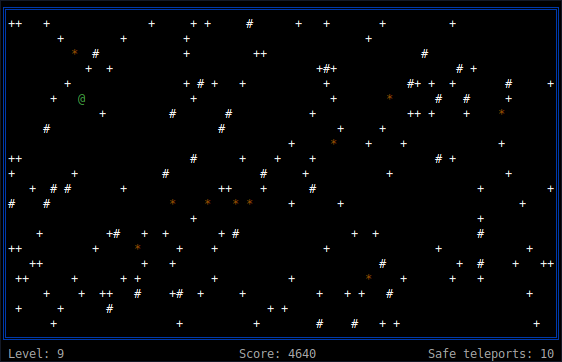

# Daleks

Escape from evil robots who want to exterminate you.



Daleks pits you against evil robots, who are trying to kill you (which is why
they are evil).  
Fortunately for you, even though they are evil, they are not very bright
and have a habit of bumping into each other, thus destroying themselves.
In order to survive, you must get them to kill each other off.  
Since you are stuck without offensive weaponry, you are endowed with one
piece of defensive weaponry: a teleportation device.  
If a robot runs into you, you die.  
When two robots run into each other or a junk pile, they die.  
When all the robots die,
you start on the next field.  
This keeps up until they finally get you or you complete the game.

The game is inspired by `gnome-robots` which in turn was inspired by `BSD robots` (aka [`Chase`](https://en.wikipedia.org/wiki/Chase_(video_game))), and so we are back to terminal.


## Instructions

```
 Directions:
 
    7   8   9        y     k     u
      \ | /           \    |   /
    4 - 5 - 6        h - SPACE - l
      / | \           /    |   \
    1   2   3        b     j     n

 Commands:
    w          : wait for end
    + or ENTER : safe teleport
    - or t     : unsafe teleport
    q          : quit
    ?          : this help
    
Legend:     
    @:  you
    +:  robot1
    #:  robot2
    *:  junk heap    
```

## Compiling

Follow these instructions to compile `daleks`.

 1. Clone the project `$ git clone https://github.com/geckoblu-games/daleks && cd daleks`
 2. Build the project `$ cargo build --release`
 3. Once complete, the binary will be located at `target/release/daleks`

